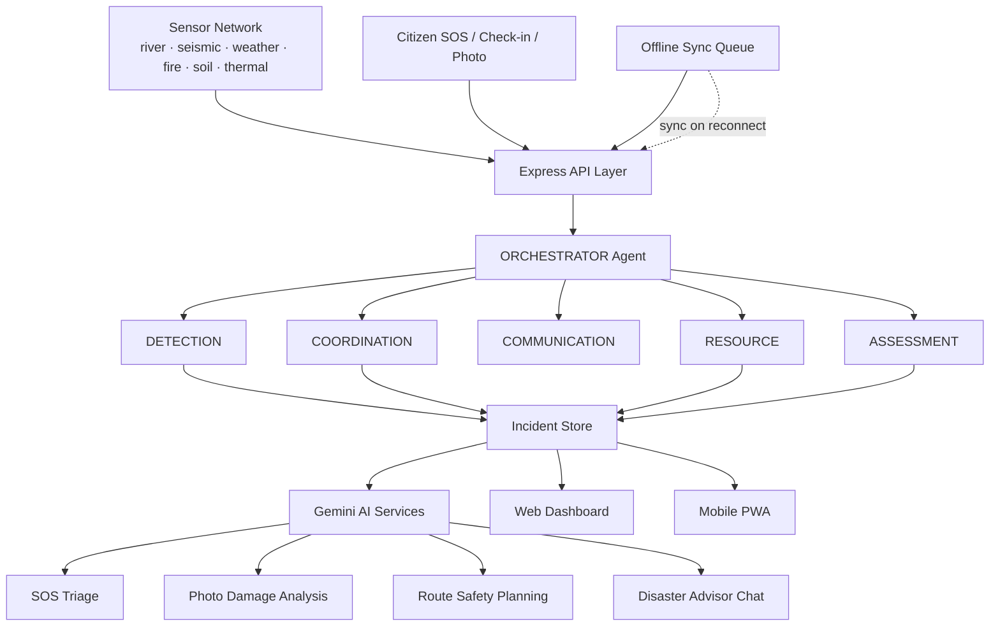

<div align="center">

# 🛰️ RakshaNet Global

### Multi-Hazard Disaster Response & Autonomous Agent Network

**Six AI agents. One live map. Zero connectivity required to stay alive.**

[](https://raksha-net-universe.vercel.app/)
[](https://vercel.com)
[](https://react.dev)
[](https://www.typescriptlang.org)
[](https://ai.google.dev)
[](#-offline--pwa-capabilities)
[](LICENSE)

### 🔗 [**⚡ LAUNCH THE LIVE PLATFORM ⚡**](https://raksha-net-universe.vercel.app/)

**`https://raksha-net-universe.vercel.app/`**

[Overview](#-what-is-this) · [Key Features](#-core-capabilities) · [The Agent Network](#-the-six-agent-network) · [Architecture](#️-system-architecture) · [Tech Stack](#-tech-stack) · [API Reference](#-api-reference) · [Setup](#-getting-started) · [Deployment](#️-deployment) · [Roadmap](#️-roadmap)

</div>

---

## 🌍 What Is This?

When a flood, earthquake, cyclone, wildfire, landslide, or heatwave hits, the first hours are chaos: sensors are screaming, shelters don't know their real capacity, families lose contact, and rescue teams have no idea who needs them most urgently. Most disaster apps solve one slice of this — an alert feed, or a shelter map, or an SOS button — in isolation.

**RakshaNet Global** is a single, live command network that ties the whole picture together. Six specialized AI agents continuously watch sensor data, detect hazards, coordinate relief teams, draft multilingual alerts, allocate resources, and assess damage — while citizens get an SOS beacon, AI-triaged emergency response, safe evacuation routing, offline check-ins, and a survival copilot that works **even with no signal.**

```
Sensors (river · seismic · weather · fire · soil · thermal)
                    │
                    ▼
        🤖 ORCHESTRATOR — routes to the right specialist agent
                    │
   ┌────────────────┼─────────────────┬──────────────────┬──────────────────┐
   ▼                ▼                 ▼                  ▼                  ▼
DETECTION      COORDINATION      COMMUNICATION        RESOURCE          ASSESSMENT
hazard scoring  team dispatch    multilingual alerts   shelter/team     damage &
+ confidence    + shelter match   + channel routing     allocation       loss estimate
   │                │                 │                  │                  │
   └────────────────┴─────────────────┴──────────────────┴──────────────────┘
                                       ▼
                    Live Web Dashboard · Mobile PWA · Offline Sync
```

---

## ✨ Core Capabilities

### 🆘 One-Tap SOS with AI Triage
A single SOS beacon captures GPS location and situation details; Gemini triages the report in seconds, assigning severity and the appropriate response path — even before a human dispatcher sees it.

### 🗺️ Live Incident & Shelter Map
An interactive Leaflet map plotting active incidents, sensor readings, evacuation shelters (with live capacity vs. occupancy), and deployed relief teams — color-coded by severity and status.

### 🧭 AI-Planned Safe Evacuation Routes
Requests a route to the nearest shelter and receives a full evacuation plan: waypoints, hazard-avoidance instructions, a **0–100 safety score**, estimated walk time, hazard crossings avoided, and a status of `SAFE / CAUTION / IMPASSABLE`.

### 📸 Photo Damage Scanner
Snap a photo of a structure or scene; Gemini Vision returns a risk level (`LOW → MODERATE → SEVERE → IMMINENT_COLLAPSE`), a structural integrity score, detected hazards, and a clear safe-to-enter verdict.

### ✅ "I'm Safe" Check-in & Family Tracker
Citizens broadcast their status (`Safe / Need Help / At Shelter / Trapped / Sheltering in Place`) with location — synced across devices, with a family board showing each member's last-known status and battery level.

### 🌦️ Hyperlocal Weather & Flood-Risk Forecasting
Vicinity-based current conditions, hourly precipitation with flood-risk percentage, and a daily forecast — feeding a **movement decision engine** that outputs a clear travel verdict: `CLEAR / CAUTION / RESTRICTED / NO_TRAVEL`, recommended transport mode, and evacuation priority.

### 🎒 Emergency Kit Checklist
A categorized preparedness checklist (Water & Food, Medical, Tools & Light, Documents & Comms, Personal) with critical-item flags, so households can verify readiness before a disaster — not during one.

### 🔊 Emergency Beacon & Read-Aloud Alerts
An audible locator beacon for search teams in low-visibility conditions, plus text-to-speech alert playback so warnings reach people who can't read a screen in the moment.

### 🤖 Emergency AI Chatbot
A conversational disaster-survival copilot answering situational questions grounded in the live incident and shelter data.

### 📡 Offline-First Sync
Check-ins and critical data queue locally when offline and sync automatically the moment connectivity returns, with a persistent offline-status banner and cached map tiles for navigation without a live connection.

### 🖥️📱 Dual-Mode Interface
A full **Web Dashboard** for command-centre operators, and a dedicated **Mobile App View** optimized for citizens in the field — both drawing from the same live data.

---

## 🤖 The Six-Agent Network

RakshaNet's intelligence layer is organized as six named, purpose-built AI agents, each logging its own reasoning in a live agent activity feed:

| Agent | Role |
|---|---|
| 🧠 **ORCHESTRATOR** | Routes incoming signals to the correct specialist agent and coordinates the overall response |
| 🔍 **DETECTION** | Converts raw sensor readings into classified hazard detections with confidence scores |
| 🚒 **COORDINATION** | Matches relief teams to incidents and shelters based on proximity, capacity, and readiness |
| 📢 **COMMUNICATION** | Drafts and routes multilingual emergency alerts across channels |
| 📦 **RESOURCE** | Allocates shelter capacity and team deployment against real-time demand |
| 🏚️ **ASSESSMENT** | Produces damage assessments — loss estimates, affected homes, blocked roads, relief priority |

Six disaster types are modeled end-to-end: **flood, earthquake, cyclone, wildfire, landslide, and heatwave** — each carrying its own detection thresholds, action plans, and evacuation radii.

---

## 🏗️ System Architecture



**Flow:** sensors and citizen reports enter the system → the Orchestrator routes each signal to the right specialist agent → hazards become incidents with action plans → Communication drafts alerts, Coordination dispatches teams, Resource allocates shelters, Assessment scores the damage → everything renders live on the dashboard and mobile PWA, with offline check-ins syncing back the moment a device reconnects.

---

## 🧰 Tech Stack

| Layer | Technology |
|---|---|
| **Frontend** | React 19, TypeScript, Vite 8, Tailwind CSS 4 |
| **Mapping** | Leaflet + custom offline tile caching |
| **UI / UX** | Lucide React icons, Motion (animations) |
| **PWA** | `vite-plugin-pwa`, Web App Manifest with app shortcuts, offline-first shell |
| **Backend** | Node.js, Express 4, TypeScript (`tsx` / `esbuild`) |
| **AI** | Google Gemini via `@google/genai` — SOS triage, photo analysis, routing, advisor chat |
| **Speech** | Web Speech API (alert read-aloud) |
| **Deployment** | Vercel |

---

## 📶 Offline & PWA Capabilities

RakshaNet installs as a native-feeling app with three home-screen shortcuts — **SOS Emergency**, **Nearest Shelters**, and **I'm Safe Check-in** — for one-tap access in a crisis. Map tiles are cached for offline navigation, check-ins queue locally and sync automatically on reconnect, and a persistent banner keeps the user aware of their sync state at all times.

---

## 🚀 Getting Started

### Prerequisites
- **Node.js 18+**
- A **Google Gemini API key** — [get one here](https://aistudio.google.com/apikey)

### Installation

```bash
# 1. Clone the repository
git clone https://github.com/Sathihacker2006/RakshaNet-Universe.git
cd RakshaNet-Universe

# 2. Install dependencies
npm install

# 3. Configure environment
cp .env.example .env
# add your Gemini key to .env

# 4. Start the dev server
npm run dev
```

The app runs at **http://localhost:3000**

### Environment Variables

```env
GEMINI_API_KEY="your_gemini_api_key"
APP_URL="http://localhost:3000"
```

> 🔐 `.env` is gitignored — never commit API keys. Rotate immediately if one is ever exposed.

### Available Scripts

| Command | Description |
|---|---|
| `npm run dev` | Dev server with Vite middleware + HMR |
| `npm run build` | Build client (Vite) and bundle server (esbuild) |
| `npm start` | Run the production build |
| `npm run preview` | Preview the built client |
| `npm run lint` | Type-check with `tsc --noEmit` |
| `npm run clean` | Remove build artifacts |

---

## 🔌 API Reference

**Base URL:** `https://raksha-net-universe.vercel.app/api`

### Live Data
| Method | Endpoint | Description |
|---|---|---|
| `GET` | `/health` | Service health check |
| `GET` | `/shelters` | All shelters with live capacity and status |
| `GET` | `/teams` | Relief team roster and deployment status |
| `GET` | `/sensors` | Live sensor network readings |
| `GET` | `/incidents` | Active and historical incidents |
| `GET` | `/alerts` | Emergency alerts by channel and severity |
| `GET` | `/logs` | Live multi-agent activity log |
| `GET` | `/checkins` | Citizen check-in records |
| `GET` | `/weather` | Vicinity weather, flood risk, and movement decision |
| `GET` | `/stats` | System-wide summary statistics |

### Citizen Actions
| Method | Endpoint | Description |
|---|---|---|
| `POST` | `/checkin` | Submit an "I'm Safe" or status check-in |
| `POST` | `/sync` | Sync a batch of offline-queued check-ins |
| `POST` | `/route-plan` | Generate a safe evacuation route to a shelter |

### AI Services
| Method | Endpoint | Description |
|---|---|---|
| `POST` | `/gemini/advisor` | Ask the disaster-survival AI advisor |
| `POST` | `/gemini/triage-sos` | AI triage of an incoming SOS report |
| `POST` | `/gemini/analyze-photo` | AI structural damage analysis from a photo |

### Simulation & Ops
| Method | Endpoint | Description |
|---|---|---|
| `POST` | `/simulate` | Trigger a simulated hazard/incident scenario |
| `POST` | `/reset` | Reset simulation state |
| `POST` | `/sensors/update` | Push updated sensor readings |

---

## 🗂️ Project Structure

```
RakshaNet-Universe/
├── server.ts                        # Express API, 6-agent orchestration, Gemini services
├── vite.config.ts                   # Vite + React + Tailwind + PWA config
├── index.html                       # App shell
├── .env.example                     # Environment template
├── public/
│   ├── manifest.json                # PWA manifest with app shortcuts
│   └── icon.svg
└── src/
    ├── main.tsx                     # React entry point
    ├── App.tsx                      # Root state & view routing
    ├── types.ts                     # Incident, Shelter, Agent, Weather types
    ├── data/
    │   ├── defaultData.ts           # Seed shelters, teams, sensors
    │   └── translations.ts          # Multilingual alert strings
    ├── services/
    │   ├── api.ts                   # API client
    │   ├── storage.ts               # Local/offline persistence
    │   ├── tileCache.ts             # Offline map tile caching
    │   └── alertSpeech.ts           # Text-to-speech alert playback
    └── components/
        ├── Header.tsx                  # Navigation & mode switch
        ├── WebDashboardView.tsx        # Command-centre dashboard
        ├── MobileAppView.tsx           # Citizen-facing mobile view
        ├── InteractiveMap.tsx          # Base map component
        ├── LiveIncidentMap.tsx         # Incident/sensor overlay map
        ├── GoogleMapsExplorer.tsx      # Location explorer
        ├── SosModal.tsx                # SOS submission + AI triage
        ├── CheckinModal.tsx            # "I'm Safe" check-in
        ├── SafeRouteModal.tsx          # AI evacuation route planner
        ├── PhotoDamageScanner.tsx      # AI photo damage analysis
        ├── ReliefTeamTracker.tsx       # Team deployment tracking
        ├── EmergencyKitDrawer.tsx      # Preparedness checklist
        ├── EmergencyBeaconModal.tsx    # Audible locator beacon
        ├── EmergencyChatbot.tsx        # AI disaster advisor chat
        ├── AlertReadAloudButton.tsx    # Text-to-speech alerts
        ├── WeatherForecastWidget.tsx   # Weather summary widget
        ├── WeatherForecastModal.tsx    # Full forecast + movement advice
        ├── OfflineMapCacheModal.tsx    # Offline tile cache manager
        └── OfflineSyncBanner.tsx       # Sync status indicator
```

---

## ☁️ Deployment

Deployed on **Vercel**.

| Setting | Value |
|---|---|
| **Framework Preset** | Vite |
| **Build Command** | `npm run build` |
| **Output Directory** | `dist` |
| **Environment Variables** | `GEMINI_API_KEY` (set as a Vercel secret) |

**Live URL:** https://raksha-net-universe.vercel.app/

---

## 🗺️ Roadmap

- [ ] Real sensor ingestion (IoT / government hazard feeds) replacing simulated telemetry
- [ ] Persistent database replacing in-memory server state
- [ ] Native push notifications for critical alerts
- [ ] SMS/USSD fallback channel for zero-smartphone reach
- [ ] Verified-responder authentication for relief team accounts
- [ ] Expanded multilingual alert coverage
- [ ] Integration hooks for official national disaster-management systems
- [ ] Post-incident analytics and after-action reporting

---

## 🤝 Contributing

```bash
git checkout -b feature/your-feature-name
git commit -m "Add: clear description of your change"
git push origin feature/your-feature-name
# Open a Pull Request
```

Run `npm run lint` before submitting. If you add a new disaster type or agent behavior, extend both `src/types.ts` and the corresponding logic in `server.ts`.

---

## 📄 License

Distributed under the MIT License. See [`LICENSE`](LICENSE) for details.

---

## 👤 Author

**Sathiyamoorthi**

[](https://github.com/Sathihacker2006)

---

<div align="center">

### ⭐ If this project helps you, consider starring the repository.

**[🛰️ Try the Live Platform](https://raksha-net-universe.vercel.app/)**

*When the network goes down, RakshaNet doesn't.*

</div>
